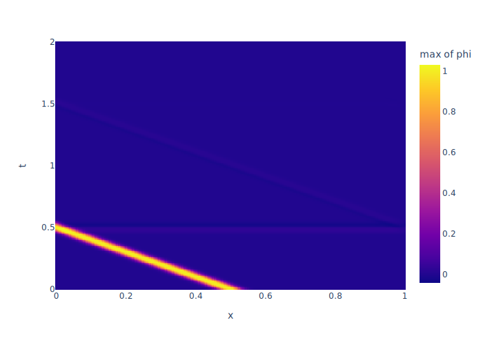

# Übungsblatt 6

bei manchen werten von alpha verhalten sich die lösungen mittels FTCS-Schema (diffusion.c) ähnlich, wie die mittels _Crank-Nicolson-Verfahren_ **CNV** (diffusion-gpl.c aus den vorlesungsmaterialien)

Bei der selbst implementierten lösung mit FTCS (jeweils oben) fallen hier (alpha=0,5 so wie im code) die werte deutlich schnelelr ab, als beim CNV (jeweils unten)

bei alpha=0,8 (DT = 8.e-4) sieht man diesen unterschied sehr deutlich

bei alpha=1 (DT = 1.e-3) divergiert die funktion komplett

Wenn wir andere werte, als DT verändern erhalten wir folgendes:

bei alpha=0,4 (DT = 1.e-3, DX =2.e-3) 

bei alpha=0,5 (DT = 1.e-3, D =5.e-4) 

Hier sehen wir wieder den gleichen effekt, der aber vermutlich nichts mit der methode, sondern einem Fehler/Unterschied in der Implementation liegt